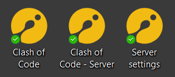
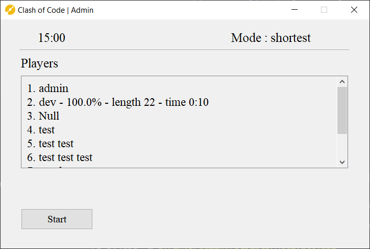
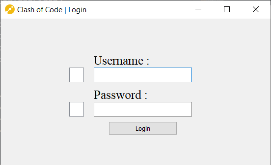
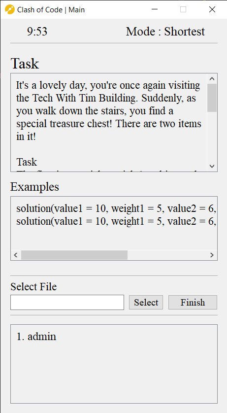
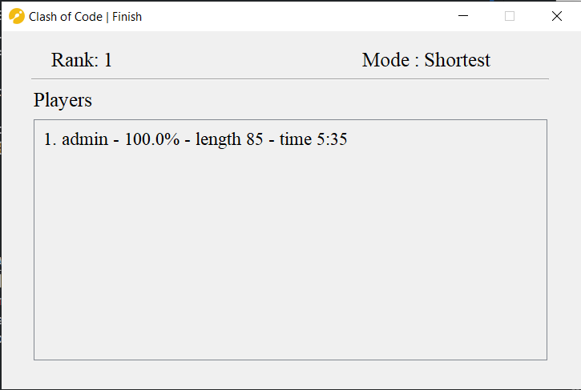

# Clash of Code

Its a [Clash of code](https://www.codingame.com/multiplayer/clashofcode) inspired multiplayer competitive programing game that runs on a local network. It can be usefull in schools where it could be used as a test taking method.

Before running anything, you need to first install all the dependencies stated in the `requirements.txt` file using the command below in terminal of your choice

```powershell
# in terminal
D:\Coc> pip install -r requirements.txt
```

After installing the dependencies, run the `Setup.py` file to get the shortcuts to `ClashOfCode\client\client.py`, `ClashOfCode\server\server.py` and `ClashOfCode\server\settings.py` on your desktop and you can re-run that file for setting the ip of the server when running the client or you can do the same thing by going in `ClashOfCode\client\settings.py` and changing it there directly



After installing the dependencies, change the directory from `ClashOfCode` to `ClashOfCode\server` (as shown below) and you can make a new account using the command shown below (replace `username` and `password` with the username and password for the account respectively)

```powershell
# in terminal
D:\ClashOfCode> cd server
D:\ClashOfCode\server> python database.py newuser username password
```

To initialise the server, you need to make 3 files,

1. Example file : (Named `example.py`) the file should be of similar format like the one shown below or you can just use the same file as given below

```py
def solution(input_):       # input goes in the place of "input_"

    # This is where you write your code
    # (with the indent)
    # This file is just for reference and to tell
    # what layout your answer shoulf look like

    # the final output of you solution has to be returned and not printed

    output = ''
    return output
```

2. Solution file : (Named `check.py`) The function has to be named `solution` (with the same case), it can also be a lambda function

```py
def solution(n):
    return n**2
# or
solution = lambda n: n**2
```

3. Test cases : (Named `test_cases.py`) You can do anything to generate the test casses, but the final generated test cases should be a list named `cases` (with the same case)

```py
cases = range(1,21)
```

And after making all 3 files, put them in a folder and put the folder's full path in the `folder` variable in the `server\settings.py` file. You also specify the Task descripition, `Mode`, `Time` and the `Examples` that are to be shown to the player here in the same format as shown below

```py
folder = "" # Full path of the folder where the files are
EXAMPLE_FILE = f"{folder}\\example.py"
SOLUTION_FILE = f"{folder}\\check.py"
TEST_CASES = f"{folder}\\test_cases.py"

MODE = "Shortest"
TIME = 10
TASK = "test task"*10
EXAMPLES = {
    1: 1,
    2: 4,
    3: 9
}
```

There are also some presets, which are specified in the same file (`server\settings.py`), to set a preset, you specify it in the variable `PRESET`. The availabe presets are specified in a dictionary named `presets` in the form of its keys, for example, you can either set `PRESET` as `presets.keys()[1]` or `"Treasure"` to play the Tresaure challange

```py
presets_folder = os.getcwd() + "\\presets" # ClashOfCode\server\presets
presets = {
    'CardTiming': f"{presets_folder}\\CardTiming",
    'Treasure': f"{presets_folder}\\Treasure"
}
PRESET = 'Treasure' # Choose from the presets dictionary
```

When you run the `ClashOfCode\server\server.py` file, the following gui shows up on the left is the time that is availabe to the player and on the right is the mode. Press the start button to start the game. (You need at least one player to start)



When you open up the `ClashOfCode\server\server.py`, you see the following, you need to enter your username and password to access the main page.



After logging in, the following gui shows up, On the left is the timer, and in the right is the game mode.\
The way you submit your answer is that you write a python file (`.py`) where your answer is a function named `solution`.
After you have written your answer, hit the `select` button and select the file containing your solution and then hit the `Finish` button, your solution will be sent to the server.



After you have finished, the below shown gui will show up where you can see your rank and the leaderboard.

  
